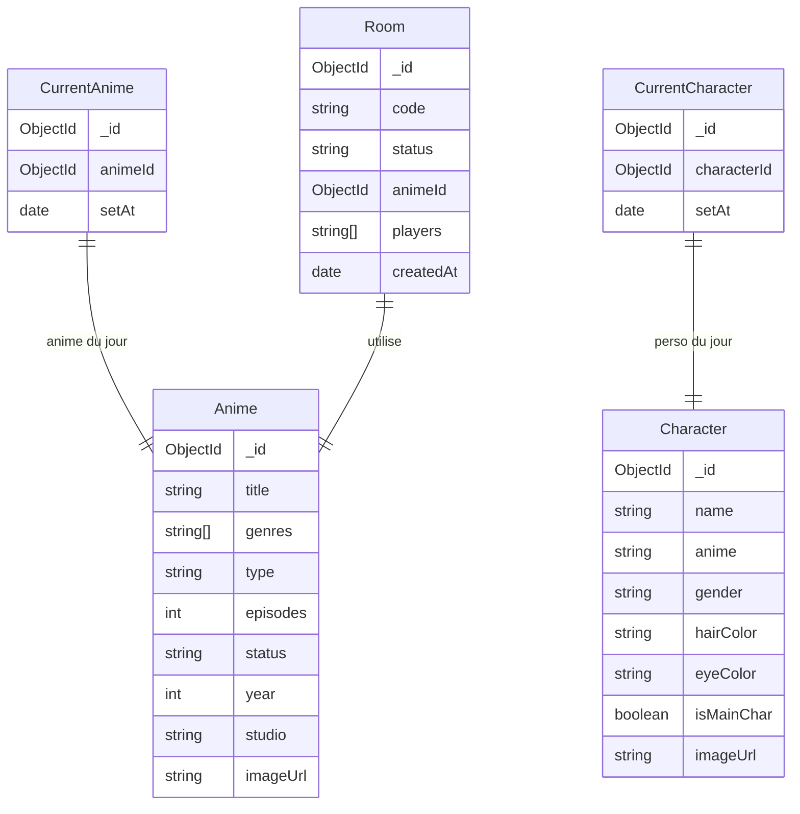
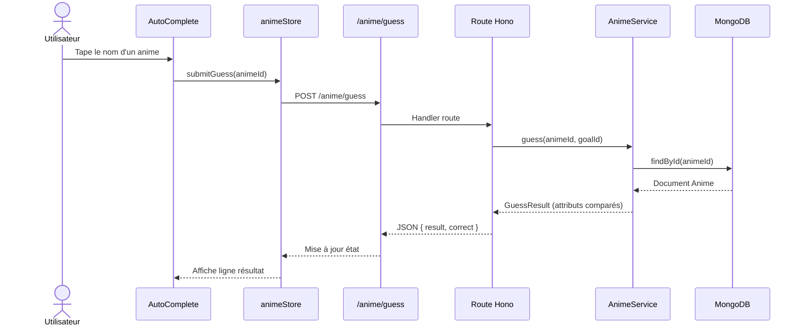

# Animdle

<div class="text-xl mt-2 opacity-70">Jeu de devinette d'anime — Wordle rencontre MyAnimeList</div>

<div class="mt-12 flex gap-3">
  <span class="tag">React 19</span>
  <span class="tag">Hono</span>
  <span class="tag">MongoDB</span>
  <span class="tag">WebSocket</span>
</div>

<div class="abs-br m-8 text-sm opacity-50">
  MIAGE — Projet Web · 2025
</div>

<!--
Bonjour, on va vous présenter Animdle, notre projet de jeu web inspiré de Wordle mais pour les fans d'anime.
-->

---
layout: default
---

# Sommaire

<div class="grid grid-cols-3 gap-6 mt-8">

<div class="p-5 rounded-xl border border-[#F07060]/30 bg-[#F07060]/5">
  <div class="text-3xl font-bold text-[#F07060]">01</div>
  <div class="text-lg font-semibold mt-2">Démo</div>
  <div class="text-sm opacity-60 mt-1">5 min — Découverte de l'application</div>
</div>

<div class="p-5 rounded-xl border border-[#8BAFD4]/30 bg-[#8BAFD4]/5">
  <div class="text-3xl font-bold text-[#8BAFD4]">02</div>
  <div class="text-lg font-semibold mt-2">Architecture</div>
  <div class="text-sm opacity-60 mt-1">5 min — Stack, MVVM, modèle de données</div>
</div>

<div class="p-5 rounded-xl border border-[#F07060]/30 bg-[#F07060]/5">
  <div class="text-3xl font-bold text-[#F07060]">03</div>
  <div class="text-lg font-semibold mt-2">Action complète</div>
  <div class="text-sm opacity-60 mt-1">5 min — Trace d'un guess bout en bout</div>
</div>

</div>

---
layout: section
---

# 01 — Démo

<div class="opacity-60 text-xl">Découverte de l'application</div>

---
layout: center
---

<div class="text-center">
  <div class="text-8xl mb-6">🎮</div>
  <div class="text-3xl font-bold text-[#F07060]">Démo Live</div>
  <div class="text-lg opacity-60 mt-3">Démonstration de l'application en direct</div>
  <div class="mt-8 flex justify-center gap-4 flex-wrap">
    <span class="tag">Mode Daily</span>
    <span class="tag">Mode Endless</span>
    <span class="tag">Mode Character</span>
    <span class="tag">Mode Challenge</span>
  </div>
</div>

<!--
Montrer les 4 modes, insister sur le mode Challenge (multijoueur WebSocket).
Points bonus à mentionner: autocomplete, tableau de comparaison attributs, cron daily.
-->

---
layout: section
---

# 02 — Architecture

<div class="opacity-60 text-xl">Stack technique & choix de conception</div>

---
layout: two-cols-header
---

# Stack Technique

::left::

### Frontend

<div class="mt-3 space-y-2">
  <div class="flex items-center gap-2"><span class="tag">React 19</span> Composants & hooks</div>
  <div class="flex items-center gap-2"><span class="tag">Vite</span> Build ultra-rapide</div>
  <div class="flex items-center gap-2"><span class="tag">Tailwind v4</span> Styling utility-first</div>
  <div class="flex items-center gap-2"><span class="tag">React Router v7</span> Routing SPA</div>
  <div class="flex items-center gap-2"><span class="tag">Zustand</span> State management léger</div>
  <div class="flex items-center gap-2"><span class="tag">shadcn/ui</span> Composants UI</div>
</div>

::right::

### Backend

<div class="mt-3 space-y-2">
  <div class="flex items-center gap-2"><span class="tag tag-blue">Hono</span> Framework HTTP typé</div>
  <div class="flex items-center gap-2"><span class="tag tag-blue">Bun</span> Runtime JS performant</div>
  <div class="flex items-center gap-2"><span class="tag tag-blue">MongoDB</span> Base de données NoSQL</div>
  <div class="flex items-center gap-2"><span class="tag tag-blue">better-auth</span> Auth email/password</div>
  <div class="flex items-center gap-2"><span class="tag tag-blue">WebSocket</span> Multijoueur temps réel</div>
  <div class="flex items-center gap-2"><span class="tag tag-blue">Docker + Nginx</span> Déploiement</div>
</div>

<!--
Justifier Bun + Hono: performance native, TypeScript first-class, API Web standards.
Zustand vs Redux: beaucoup plus simple, pas de boilerplate.
-->

---
layout: two-cols
layoutClass: gap-8
---

# Frontend — MVVM

Architecture **Model-View-ViewModel** appliquée à React

<div class="mt-4 space-y-4">

<div v-click class="p-3 rounded-lg border border-[#F07060]/30">
  <span class="font-bold text-[#F07060]">View</span>
  <span class="opacity-70 ml-2 text-sm">Composants purs, pas de logique métier</span>
  <div class="text-xs opacity-50 mt-1 font-mono">DailyGuessingPage, GuessTable…</div>
</div>

<div v-click class="p-3 rounded-lg border border-[#8BAFD4]/30">
  <span class="font-bold text-[#8BAFD4]">ViewModel</span>
  <span class="opacity-70 ml-2 text-sm">Hooks custom, état local + actions</span>
  <div class="text-xs opacity-50 mt-1 font-mono">useHomePageViewModel, useEndlessViewModel…</div>
</div>

<div v-click class="p-3 rounded-lg border border-white/20">
  <span class="font-bold">Store (Model)</span>
  <span class="opacity-70 ml-2 text-sm">État global Zustand</span>
  <div class="text-xs opacity-50 mt-1 font-mono">animeStore, challengeStore, userStore…</div>
</div>

</div>

::right::

```
src/
├── pages/
│   ├── home/
│   │   ├── HomePageView.tsx      ← View
│   │   └── useHomePageViewModel  ← ViewModel
│   ├── daily/
│   │   └── DailyGuessingPage.tsx
│   ├── endless/
│   │   ├── EndlessModePage.tsx
│   │   └── useEndlessViewModel.ts
│   └── challenge/
│       └── ChallengePage.tsx
├── components/
│   ├── GuessTable.tsx
│   └── AutoComplete.tsx
├── stores/              ← Model
│   ├── animeStore.ts
│   ├── challengeStore.ts
│   └── userStore.ts
└── lib/
    ├── ws-client.ts
    └── guessing-utils.ts
```

<!--
MVVM permet de tester la logique sans l'UI, et de garder les composants React simples.
-->

---
layout: two-cols
layoutClass: gap-8
---

# Backend — Architecture

Séparation en couches : **Routes → Services → Repositories**

<div class="mt-4 space-y-3">

<div v-click class="p-3 rounded-lg border border-[#F07060]/30">
  <span class="font-bold text-[#F07060]">Routes</span> <span class="text-xs opacity-50 font-mono ml-2">Hono handlers</span>
  <div class="text-xs opacity-70 mt-1">Validation, auth middleware, HTTP/WS</div>
</div>

<div v-click class="p-3 rounded-lg border border-[#8BAFD4]/30">
  <span class="font-bold text-[#8BAFD4]">Services</span> <span class="text-xs opacity-50 font-mono ml-2">singletons</span>
  <div class="text-xs opacity-70 mt-1">Logique métier : comparaison, daily, rooms</div>
</div>

<div v-click class="p-3 rounded-lg border border-white/20">
  <span class="font-bold">Repositories</span> <span class="text-xs opacity-50 font-mono ml-2">MongoDB</span>
  <div class="text-xs opacity-70 mt-1">Accès données, requêtes, persistence</div>
</div>

<div v-click class="p-3 rounded-lg border border-white/10 opacity-70">
  <span class="font-bold">Cron</span>
  <div class="text-xs mt-1">Minuit UTC → change l'anime & perso du jour</div>
</div>

</div>

::right::

```
backend/src/
├── routes/
│   ├── anime.ts        GET, guess, daily
│   ├── auth.ts         Login / Register
│   ├── admin.ts        CRUD + stats
│   ├── room.ts         Créer / rejoindre salle
│   └── room-guess.ts   Guess en salle
├── services/
│   ├── AnimeService.ts     ← singleton
│   ├── CharacterService.ts ← singleton
│   └── RoomService.ts
├── repositories/
│   ├── AnimeRepository.ts
│   ├── CharacterRepository.ts
│   └── CurrentAnimeRepository.ts
├── wsHandlers.ts       WebSocket challenge
└── index.ts            App + cron daily
```

---

# Modèle de Données

Collections MongoDB



<!--
CurrentAnime et CurrentCharacter sont des singletons en BDD — mis à jour par le cron minuit.
Room référence l'anime en cours pour le mode challenge.
-->

---
layout: section
---

# 03 — Action Complète

<div class="opacity-60 text-xl">Trace bout en bout d'un guess utilisateur</div>

---

# Vue d'ensemble — Soumettre un Guess



<!--
On va détailler chaque étape dans les slides suivantes avec le vrai code du projet.
-->

---
layout: two-cols
layoutClass: gap-6
---

# <span class="step">1</span> Composant — AutoComplete

**View** : `src/components/AutoComplete.tsx`

Saisie utilisateur → sélection d'un anime dans la liste

::right::

```tsx {all}
// [CODE RÉEL ICI]
// src/components/AutoComplete.tsx
```

<!--
Montrer: input contrôlé, debounce, filtrage de la liste, onClick → dispatch vers le ViewModel/Store.
-->

---
layout: two-cols
layoutClass: gap-6
---

# <span class="step">2</span> ViewModel + Store

**ViewModel** : `useEndlessViewModel.ts` (ou Daily)

Appel API via `lib/guessing-utils.ts`

```
submitGuess(animeId)
  → POST /anime/guess
  → update animeStore.guesses
```

::right::

```ts {all}
// [CODE RÉEL ICI]
// src/pages/endless/useEndlessViewModel.ts
// ou src/lib/guessing-utils.ts
```

<!--
Zustand : action simple, pas de dispatch/action creator. Le store notifie les composants abonnés.
-->

---
layout: two-cols
layoutClass: gap-6
---

# <span class="step">3</span> Route Hono

**Route** : `backend/src/routes/anime.ts`

Reçoit la requête, vérifie auth, délègue au service

::right::

```ts {all}
// [CODE RÉEL ICI]
// backend/src/routes/anime.ts
// handler POST /anime/guess
```

<!--
Hono : middleware auth, validation du body (animeId), puis appel AnimeService.
-->

---
layout: two-cols
layoutClass: gap-6
---

# <span class="step">4</span> AnimeService

**Service** : `backend/src/services/AnimeService.ts`

Logique métier : compare les attributs de l'anime guessé avec le goal

::right::

```ts {all}
// [CODE RÉEL ICI]
// backend/src/services/AnimeService.ts
// méthode guess(animeId, goalAnimeId)
```

<!--
C'est ici que la logique Wordle se passe : chaque attribut est comparé (exact / proche / faux).
Le "goal" (anime du jour) est chargé depuis CurrentAnimeRepository (mis en cache en mémoire).
-->

---
layout: two-cols
layoutClass: gap-6
---

# <span class="step">5</span> Repository → MongoDB

**Repository** : `backend/src/repositories/AnimeRepository.ts`

Requête MongoDB, retourne le document complet

::right::

```ts {all}
// [CODE RÉEL ICI]
// backend/src/repositories/AnimeRepository.ts
// méthode findById(id)
```

<!--
Simple wrapper Mongo. Le service reçoit l'objet Anime complet et construit le GuessResult.
-->

---
layout: center
---

<div class="text-center">
  <div class="text-7xl mb-4">✅</div>
  <div class="text-2xl font-bold">Résultat retourné</div>
  <div class="text-lg opacity-70 mt-3 mb-8">Chaque attribut coloré : vert / orange / rouge</div>

  <div class="grid grid-cols-5 gap-2 max-w-lg mx-auto text-sm">
    <div class="p-2 rounded bg-green-800/40 border border-green-500/50">Genre ✓</div>
    <div class="p-2 rounded bg-red-800/40 border border-red-500/50">Type ✗</div>
    <div class="p-2 rounded bg-orange-800/40 border border-orange-500/50">Année ≈</div>
    <div class="p-2 rounded bg-green-800/40 border border-green-500/50">Studio ✓</div>
    <div class="p-2 rounded bg-red-800/40 border border-red-500/50">Éps ✗</div>
  </div>
</div>

---
layout: end
---

# Merci

<div class="text-lg opacity-70 mt-4">Questions ?</div>

<div class="mt-8 flex justify-center gap-4">
  <span class="tag">Animdle</span>
  <span class="tag-blue">MIAGE 2025</span>
</div>

<!--
Ouvrir la discussion. Points qu'on peut approfondir :
- Choix Bun vs Node
- Gestion des rooms WebSocket
- Admin dashboard
- Difficultés rencontrées
-->
