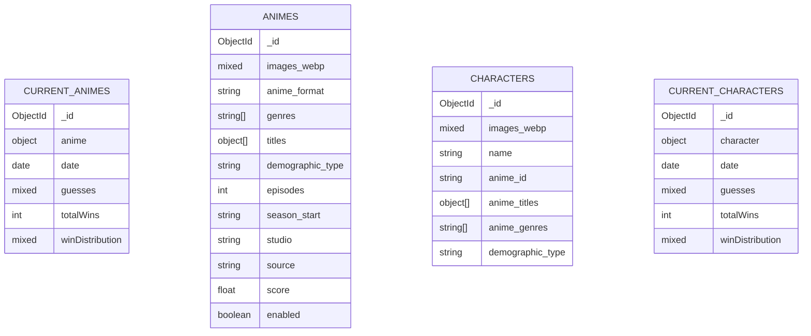
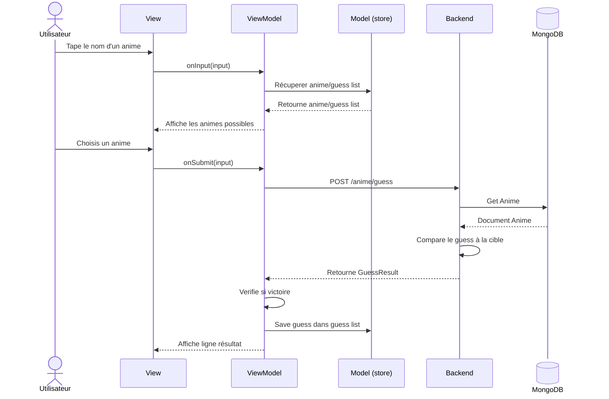

# Animdle

<div class="text-xl mt-2 opacity-70">Jeu de devinette d'anime — Wordle rencontre MyAnimeList</div>

<div class="mt-12 flex gap-3">
  <span class="tag">React 19</span>
  <span class="tag">Hono</span>
  <span class="tag">MongoDB</span>
  <span class="tag">WebSocket</span>
</div>

<div class="abs-br m-8 text-sm opacity-50">
  MIAGE — Projet Web · 2025
</div>

<!--
Bonjour, on va vous présenter Animdle, notre projet de jeu web inspiré de Wordle mais pour les fans d'anime.
-->

---
layout: default
---

# Sommaire

<div class="grid grid-cols-3 gap-6 mt-8">

<div class="p-5 rounded-xl border border-[#F07060]/30 bg-[#F07060]/5">
  <div class="text-3xl font-bold text-[#F07060]">01</div>
  <div class="text-lg font-semibold mt-2">Démo</div>
  <div class="text-sm opacity-60 mt-1">5 min — Découverte de l'application</div>
</div>

<div class="p-5 rounded-xl border border-[#8BAFD4]/30 bg-[#8BAFD4]/5">
  <div class="text-3xl font-bold text-[#8BAFD4]">02</div>
  <div class="text-lg font-semibold mt-2">Architecture</div>
  <div class="text-sm opacity-60 mt-1">5 min — Stack, MVVM, modèle de données</div>
</div>

<div class="p-5 rounded-xl border border-[#F07060]/30 bg-[#F07060]/5">
  <div class="text-3xl font-bold text-[#F07060]">03</div>
  <div class="text-lg font-semibold mt-2">Action complète</div>
  <div class="text-sm opacity-60 mt-1">5 min — Trace d'un guess bout en bout</div>
</div>

</div>

---
layout: section
---

# 01 — Démo

<div class="opacity-60 text-xl">Découverte de l'application</div>

---
layout: center
---

<div class="text-center">
  <div class="text-8xl mb-6">🎮</div>
  <div class="text-3xl font-bold text-[#F07060]">Démo Live</div>
  <div class="text-lg opacity-60 mt-3">Démonstration de l'application en direct</div>
  <div class="mt-8 flex justify-center gap-4 flex-wrap">
    <span class="tag">Mode Daily</span>
    <span class="tag">Mode Character</span>
    <span class="tag">Mode(s) Endless</span>
    <span class="tag">Mode Challenge</span>
  </div>
</div>

<!--
Montrer les 4 modes, insister sur le mode Challenge (multijoueur WebSocket).
Points bonus à mentionner: autocomplete, tableau de comparaison attributs, cron daily.
-->

---
layout: section
---

# 02 — Architecture

<div class="opacity-60 text-xl">Stack technique & choix de conception</div>

---
layout: two-cols-header
---

# Stack Technique
### En commun

<div class="grid grid-cols-2 gap-2 mb-12">
  <div class="flex items-center gap-2"><span class="w-[150px]"><span class="tag tag-orange">Bun</span></span> Runtime JS</div>
  <div class="flex items-center gap-2"><span class="w-[150px]"><span class="tag tag-orange">BetterAuth</span></span> Auth email/password</div>
  <div class="flex items-center gap-2"><span class="w-[150px]"><span class="tag tag-orange">Biome</span></span> Formatage et de linting</div>
  <div class="flex items-center gap-2"><span class="w-[150px]"><span class="tag tag-orange">Husky</span></span> Outil de gestion de hooks Git</div>
</div>

::left::

### Frontend

<div class="mt-3 space-y-2">
  <div class="flex items-center gap-2"><span class="w-[150px]"><span class="tag">React (router & i18n)</span></span> Bibliothèque front-end</div>
  <div class="flex items-center gap-2"><span class="w-[150px]"><span class="tag">Zustand</span></span> State management</div>
  <div class="flex items-center gap-2"><span class="w-[150px]"><span class="tag">ShadeCN & TweakCN</span></span> Composants UI</div>
  <div class="flex items-center gap-2"><span class="w-[150px]"><span class="tag">Tailwind v4</span></span> Styling utility-first</div>
</div>

::right::

### Backend

<div class="mt-3 space-y-2">
  <div class="flex items-center gap-2"><span class="w-[150px]"><span class="tag tag-blue">Hono</span></span> Framework HTTP</div>
  <div class="flex items-center gap-2"><span class="w-[150px]"><span class="tag tag-blue">Mongoose</span></span> ODM pour MongoDB</div>
  <div class="flex items-center gap-2"><span class="w-[150px]"><span class="tag tag-blue">BetterAuth</span></span> Auth email/password</div>
  <div class="flex items-center gap-2"><span class="w-[150px]"><span class="tag tag-blue">node-cron</span></span> Planification de tâches</div>
  <div class="flex items-center gap-2"><span class="w-[150px]"><span class="tag tag-blue">Bun/WS</span></span> Gestion WebSocket</div>
</div>

<!--
Justifier Bun + Hono: performance native, TypeScript first-class, API Web standards.
Zustand vs Redux: beaucoup plus simple, pas de boilerplate.
-->

---
layout: two-cols
layoutClass: gap-8
---

# Frontend — MVVM

Architecture **Model-View-ViewModel** appliquée à React

<div class="mt-4 space-y-4">

<div v-click class="p-3 rounded-lg border border-[#F07060]/30">
  <span class="font-bold text-[#F07060]">View</span>
  <span class="opacity-70 ml-2 text-sm">Composants purs, pas de logique métier</span>
  <div class="text-xs opacity-50 mt-1 font-mono">DailyGuessingPage, GuessTable…</div>
</div>

<div v-click class="p-3 rounded-lg border border-[#8BAFD4]/30">
  <span class="font-bold text-[#8BAFD4]">ViewModel</span>
  <span class="opacity-70 ml-2 text-sm">Hooks custom, état local + actions</span>
  <div class="text-xs opacity-50 mt-1 font-mono">useHomePageViewModel, useEndlessViewModel…</div>
</div>

<div v-click class="p-3 rounded-lg border border-white/20">
  <span class="font-bold">Store (Model)</span>
  <span class="opacity-70 ml-2 text-sm">État global Zustand</span>
  <div class="text-xs opacity-50 mt-1 font-mono">animeStore, challengeStore, userStore…</div>
</div>

</div>

::right::

```
src/
├── pages/
│   ├── challenge/
│   ├── daily/
│   ...
│   └── home/
│       ├── HomePageView.tsx      ← View
│       └── useHomePageViewModel  ← ViewModel
│   
├── components/       ← Composants réutilisables (View)
│   ├── GuessTable.tsx
│   └── AutoComplete.tsx
├── stores/              ← Model
│   ...
│   ├── animeStore.ts
│   └── userStore.ts 
├── i18n/               ← Internationalisation
├── hooks/              ← custom hooks
│   ...
└── lib/                ← Librairies & utilitaires
    ...
    ├── auth-client.ts
    ├── ws-client.ts
    └── guessing-utils.ts
```

<!--
MVVM permet de tester la logique sans l'UI, et de garder les composants React simples.
-->

---
layout: two-cols
layoutClass: gap-8
---

# Backend — Architecture

Séparation en couches : **Routes → Services → Repositories**

<div class="mt-4 space-y-3">

<div v-click class="p-3 rounded-lg border border-[#F07060]/30">
  <span class="font-bold text-[#F07060]">Routes</span> <span class="text-xs opacity-50 font-mono ml-2">Hono handlers</span>
  <div class="text-xs opacity-70 mt-1">Validation, auth middleware, HTTP/WS</div>
</div>

<div v-click class="p-3 rounded-lg border border-[#8BAFD4]/30">
  <span class="font-bold text-[#8BAFD4]">Services</span> <span class="text-xs opacity-50 font-mono ml-2">singletons</span>
  <div class="text-xs opacity-70 mt-1">Logique métier : comparaison, daily, rooms</div>
</div>

<div v-click class="p-3 rounded-lg border border-white/20">
  <span class="font-bold">Repositories</span> <span class="text-xs opacity-50 font-mono ml-2">MongoDB</span>
  <div class="text-xs opacity-70 mt-1">Accès données, requêtes, persistence</div>
</div>

<div v-click class="p-3 rounded-lg border border-white/10 opacity-70">
  <span class="font-bold">Cron</span>
  <div class="text-xs mt-1">Minuit UTC → change l'anime & perso du jour</div>
</div>

</div>

::right::

```
src/
├── libs/                 ← Librairies & utilitaires
│   ├── auth.ts
│   ├── db.ts
│   └── dotenv-loader.ts
├── routes/
│   ├── anime.ts        GET, guess, daily
│   ├── auth.ts         Login / Register
│   ├── admin.ts        CRUD + stats
│   ├── room.ts         Créer / rejoindre salle
│   └── room-guess.ts   Guess en salle
├── services/
│   ├── AnimeService.ts     ← singleton
│   ├── CharacterService.ts ← singleton
│   └── RoomService.ts
├── repositories/
│   ├── AnimeRepository.ts
│   ├── CharacterRepository.ts
│   └── CurrentAnimeRepository.ts
├── wsHandlers.ts       WebSocket challenge
└── index.ts            App + cron daily
```

---

# Modèle de Données

MongoDB (Mongoose) — **2 types de collections**

- **Référentiel (catalogue)**: `animes`, `characters`
- **Daily + stats (historique)**: `current_animes`, `current_characters`  
  (le “courant” = le document le plus récent, trié par `date`)



<!--
- "current_*" n'est pas juste un ID: on stocke une COPIE de l'entité (anime/character) + des stats.
- Les stats: guesses = compteur par id (clé dynamique), totalWins + winDistribution (par nombre d'essais).
- Le cron (minuit UTC) insère un nouveau doc dans current_* ; le "courant" = le plus récent.
-->

---
layout: section
---

# 03 — Action Complète

<div class="opacity-60 text-xl">Trace bout en bout d'un guess utilisateur</div>

---

# Vue d'ensemble — Soumettre un Guess



<!--
On va détailler chaque étape dans les slides suivantes avec le vrai code du projet.
-->

---
layout: two-cols
layoutClass: gap-6
---

# <span class="step">1</span> Composant — AutoComplete

**View** : `src/components/AutoComplete.tsx`

Saisie utilisateur → sélection d'un anime dans la liste

```tsx {all|2-12|4-7|6|0}
<Command>
  <CommandPrimitive.Input
    value={inputValue} [..]
    onValueChange={(value: string) => {
      setInputValue(value);
      setIsOpen(value.length > 0);
    }}
    onFocus={() => {
      if (inputValue.length > 0) {
        setIsOpen(true);
      }
    }}
  />
 [...]
</Command>
```

::right::

```tsx {0|all|3-28|5|6-25|7-24|16-23|11-16|15}
<Command>  
  [...]
  {isOpen && (<div>
    <CommandList>
      {values.length === 0 ||isFilteringLoading ? ([...]) 
        : (<CommandGroup>
          {values.map((anime) => (
            <CommandItem
              key={anime.id}
              value={anime.title}
              onSelect={() => {
                setInputValue('');
                setSelectedValue(anime.id);
                setIsOpen(false);
                onSelect?.(anime.id);
              }}>
              <div>
                
                <div> 
                  <p>{anime.title}</p> 
                  <p>{anime.alias[0]}</p>
                </div>
              </div>
            </CommandItem>))}
          </CommandGroup>)}
      </CommandList>
  </div>)}
</Command>
```

<!--
Montrer: input contrôlé, debounce, filtrage de la liste, onClick → dispatch vers le ViewModel/Store.
-->

---
layoutClass: gap-6
---

# <span class="step">2</span> ViewModel + Store

**ViewModel** : `useDailyGuessingPageViewModel.ts`

```ts {all|2|3-7|0}
 onAnimeSelect: async (animeId: string) => {
      animeStore.initGuessListIfNeeded();
      const guessResult = await makeGuessRequest({
        animeId,
        guessNumber: guessList.length + 1,
        endpoint: '/api/animes/guess',
      });
      [... result process]
    },
```

<!--
Zustand : action simple, pas de dispatch/action creator. Le store notifie les composants abonnés.
-->

---
layout: center
---

<div class="text-center">
  <div class="text-7xl mb-4">✅</div>
  <div class="text-2xl font-bold">Résultat retourné</div>
  <div class="text-lg opacity-70 mt-3 mb-8">Chaque attribut coloré : vert / orange / rouge</div>

  <div class="grid grid-cols-5 gap-2 max-w-lg mx-auto text-sm">
    <div class="p-2 rounded bg-green-800/40 border border-green-500/50">Genre ✓</div>
    <div class="p-2 rounded bg-red-800/40 border border-red-500/50">Type ✗</div>
    <div class="p-2 rounded bg-orange-800/40 border border-orange-500/50">Année ≈</div>
    <div class="p-2 rounded bg-green-800/40 border border-green-500/50">Studio ✓</div>
    <div class="p-2 rounded bg-red-800/40 border border-red-500/50">Éps ✗</div>
  </div>
</div>

---
layout: end
---

# Merci pour votre écoute

<div class="text-lg opacity-70 mt-4">Avez vous des questions ?</div>

<div class="mt-8 flex justify-center gap-4">
  <span class="tag">Animedle</span>
  <span class="tag tag-blue">MIAGE 2025</span>
</div>

<!--
Ouvrir la discussion. Points qu'on peut approfondir :
- Choix Bun vs Node
- Gestion des rooms WebSocket
- Admin dashboard
- Difficultés rencontrées
-->
